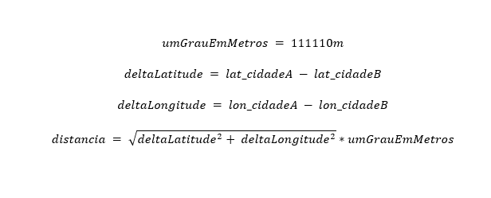

# Calculadora de distância entre cidades
## Resumo
Uma aplicação simples que faz requisições a uma API para obter a latitude e a longitude de diversas cidades e calcular a ditância em linha reta entre elas
## Requisitos
- Python 3.6 ou >
- Biblioteca Requests

## Funcionamento
O arquivo "calculo_distancia.py" contêm as funções: dicionario_cidades(), distancia_entre_cidades(), ler_csv(), salvar_csv()

**distancia_entre_cidades(lista_cidades, lista_estados):** 
Recebe duas listas como parâmetro: *lista_cidades* e *lista_estados*(Unidades Federativas).
Itera com um laço **for** sobre cada cidade e estado. 
Faz requisição na API **nominatim** e salva a latitude e longitude de cada cidade em um dicionário. No fim retorna esse dicionário.

**distancia_entre_cidades(dic, chv1, chv2):**
Recebe o dicionário criado pela função anterior e duas chaves do mesmo como parâmetro.
Utiliza as chaves para acessar a lista que contem a latitude e a longitude correpondente àquela cidade. Após isso, utiliza estes dados para fazer o cálculo da distância em linha reta entre as duas cidades.

*Equação da distância em linha reta entre duas cidades:*

**ler_csv(caminho, tem_cabecalho=True):**
A função recebe o caminho do arquivo .CSV a ser lido. O parâmetro "tem_cabecalho" vem o valor padrão setado para True, este parâmetro serve para especificar se o documento possui cabeçado em seu inicio.

**def salvar_csv(cidades_e_distancias):**
A função recebe a lista das cidades e suas respectivas distâncias. A função pede para que o usuário digite o nome que deseja atribuir ao arquivo será gerado.

## Exemplo 1
No primeiro programa o usuário informa quantas cidades serão digitadas. Após isso, o programa pede ao usuário que digite o nome e a unidade federativa das cidades que deseja medir as distância.

## Exemplo 2
O segundo programa tem um funcionamento parecido com o do primeiro, porém, neste, o programa lê as cidades e as ufs a partir de um arquivo .csv especificado pelo usuário.

## My LinkedIn
Click [here](https://www.linkedin.com/in/alberto-bruno-silvestre-de-oliveira-b7a010259/) to acesse my LinkedIn